# Ableton Session Mapper

<p align="center">
  <strong>Export, inspect and visualize an Ableton Live Set with a clean integrated modal, external HTML views, and Mermaid-based diagrams.</strong>
</p>

<p align="center">
  
  
  
  
</p>

---

## What it does

Ableton Session Mapper scans the current Live Set and produces a structured export of:

- regular tracks in Live order
- return tracks
- master track
- devices
- rack summaries
- chains / pads summaries
- sends
- manual routing overrides when provided

It was designed with two goals:

1. stay reliable inside Ableton Live with an ultra-safe scan mode
2. generate views that are actually pleasant to browse outside Live

---

## Visual overview

### Git / Metro

<p align="center">
  
</p>

### Flow

<p align="center">
  
</p>

### Kanban

<p align="center">
  
</p>

If SVG preview is limited by GitHub in your current context, the same exports also exist in [`exports/`](./exports/) as HTML / SVG / PNG / Mermaid source files.

---

## Main views

### 1. Integrated Modal

Inside Ableton Live:

- Session
- Git / Metro
- Outputs
- Devices
- Files
- Overview

This is the primary in-Live UX.

### 2. HTML Report

A readable report view for:

- track details
- devices
- sends
- rack summaries
- manual routing metadata

### 3. Session Grid

A simplified Session View-style layout:

- one column per track
- exact Live Set order
- returns after tracks
- master at the end

### 4. Flow

Technical tree view for the Set structure.

### 5. Git / Metro

Stylized metro-like map of tracks and devices.

### 6. Kanban

Column view preserving the exact track order from Session View.

---

## Project structure

```text
extension/          Ableton extension runtime
viewer-simple/      HTML report generator
session-grid/       Session-grid generator
launcher/           External launcher generator
mermaid/            Mermaid .mmd / HTML / render scripts
metro/              Custom Git / Metro view renderer
scripts/            Packaging and helper scripts
exports/            Generated outputs
release/            Installable package output
```

---

## Stable workflow

### In development

From the project root:

```bash
npm install
npm run build
npm start
```

Then in Ableton Live:

1. right-click on a supported context
2. choose `Export Session Map`
3. the Set is scanned
4. JSON + HTML outputs are generated
5. the integrated modal opens
6. external launcher / reports remain available

Important: the click context is only the entry point. The export always scans the full Live Set.

---

## Installable extension package

This repo now supports an installable Ableton package.

The local SDK confirms the official distribution format:

- package type: `.ablx`
- required file: `manifest.json`
- required entry: compiled JS file declared in `manifest.json > entry`
- install flow: drag the `.ablx` file into **Live Settings > Extensions**

Build the release package from the repo root:

```bash
npm run package:extension
```

Generated artifacts:

- [`release/Session Mapper/`](./release/Session%20Mapper)
- [`release/Ableton-Session-Mapper-v1.3.0.ablx`](./release/Ableton-Session-Mapper-v1.3.0.ablx)
- `release/Session-Mapper-v1.3.0.zip`

Installed mode uses the SDK storage directory for exports instead of the repo `exports/` folder.

---

## Available commands

### Core

```bash
npm run build
npm start
npm run package:extension
npm run clean:release
```

### HTML views

```bash
npm run generate:html
npm run generate:session-grid
npm run generate:diagrams-index
```

### Mermaid

```bash
npm run generate:mermaid:flow
npm run generate:mermaid:git
npm run generate:mermaid:kanban
npm run export:diagram:flow
npm run export:diagram:git
npm run export:diagram:kanban
npm run export:diagram:all
```

### Open helpers

```bash
npm run open:diagrams
npm run open:diagram:flow
npm run open:diagram:git
npm run open:diagram:kanban
npm run open:diagrams:http
npm run serve:exports
```

### Overrides / diagnostics

```bash
npm run create:routing-overrides
npm run refresh:routing-overrides
npm run create:device-classification-overrides
npm run generate:internal-viewer-preview
```

---

## Runtime modes

### Dev mode

- started with `npm start`
- storage is pointed to the repo root
- exports go to `./exports/`
- Mermaid SVG/PNG workflow is available

### Installed mode

- started by Live from the installed extension package
- exports go to the SDK persistent storage directory
- integrated modal remains available
- HTML Report / Session Grid / Launcher remain available
- Mermaid SVG/PNG rendering is optional and treated as a dev workflow

---

## Why the project avoids heavy in-Live rendering

This project intentionally does **not** rely on heavy embedded WebView rendering for diagrams.

Reason:

- large integrated WebViews were unstable in Live Beta during development
- the stable path is:
  - lightweight integrated modal in Live
  - richer HTML/diagram outputs externally

This keeps the core export flow reliable.

---

## Known limitations

- the main export runs in **ultra-safe** mode by design
- internal rack devices are not deeply expanded in the main export
- routing I/O is not reliably exposed by the current SDK version
- sidechains are not reliably exposed by the current SDK version
- Git / Metro is a stylized map, not an exact audio routing graph
- Mermaid SVG/PNG are optional manual renders in practice

---

## Tech stack

- Ableton Extensions SDK
- TypeScript
- Node.js
- JSON export model
- HTML/CSS/vanilla JS viewers
- Mermaid for external diagram generation

---

## License / notes

This project depends on the local Ableton Extensions SDK beta package provided separately by Ableton.

Please follow Ableton’s SDK license and branding guidelines when redistributing extensions built from this project.

---

## Quick links

- [Extension runtime](./extension)
- [Exports folder](./exports)
- [Release package](./release)
- [External launcher](./exports/session-map-diagrams.html)
- [HTML report](./exports/session-map.html)
- [Session grid](./exports/session-map-session-grid.html)

---

<p align="center">
  Built for exploring Ableton Live Sets with a more readable, developer-friendly workflow.
</p>
